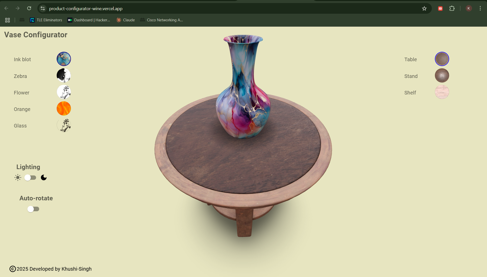
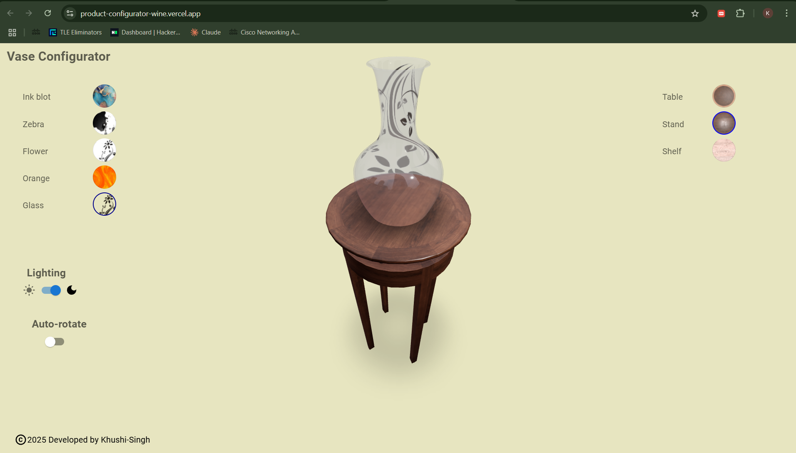

# 🧪 Product Configurator

A web based tool 3D product configurator that lets users customize colors, textures, and parts with live 3D previews—perfect for e-commerce. Easily customizable to suit any product.

## 🌐 Live Demo
[Click here to view](https://product-configurator-wine.vercel.app/)

## 🛠️ Features
- 3D visualization using Three.js  
- Dynamic product customization  
- Toggling light and dark mode button 

## 🛍️ Real-World Use Cases
- **E-commerce**: Let customers visualize their buying products in 3D before purchase.  
- **Automotive**: Allow users to configure products with different colors, textures, and interiors etc.
- **Manufacturing**: Help clients visualize custom machinery/tools before ordering.  


## 🧪 Tech Stack

| Layer        | Technologies                |
|--------------|-----------------------------|
| Frontend     | React, Vite, Three.js       |
| State        | React Context / useState    |
| 3D Models    | glTF format (loaded dynamically) |
| Styling      | CSS Modules |
| Deployment   | Vercel or Github pages|

## 📸 Glimpse of Project:
<br><br>


## 🔮 Future Vision
- AI-driven recommendations based on user preferences  
- Live pricing & inventory updates integrated in real time  
- SDK/plugin support for seamless e-commerce store integration  

## 🚀 Getting Started
```bash
git clone https://github.com/Khushi-Singh25/Product-Configurator.git
cd product-configurator
npm install
npm run dev
